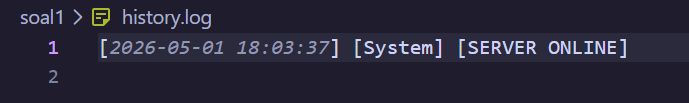
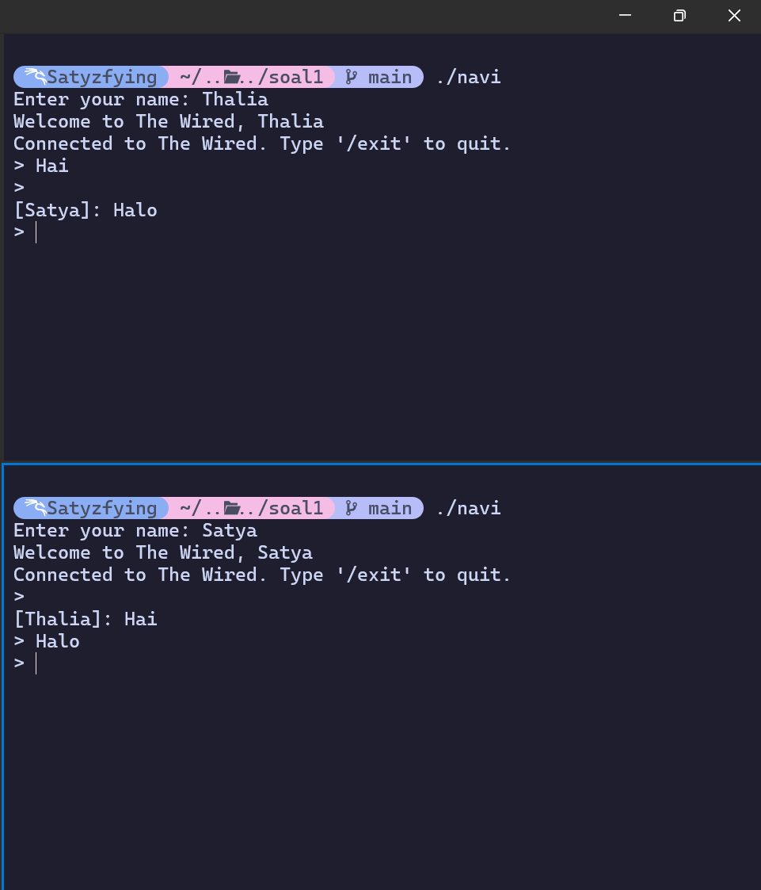
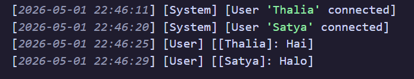
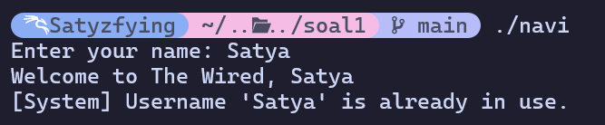
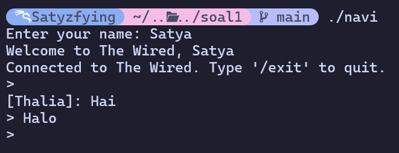
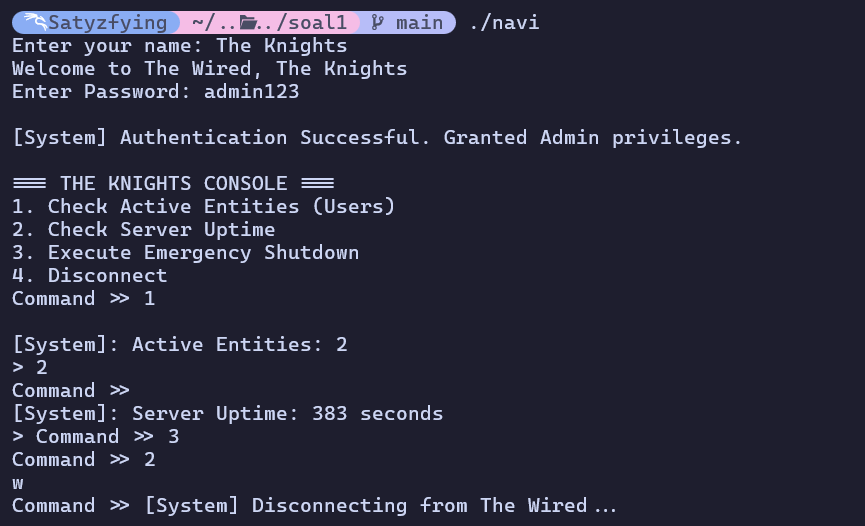
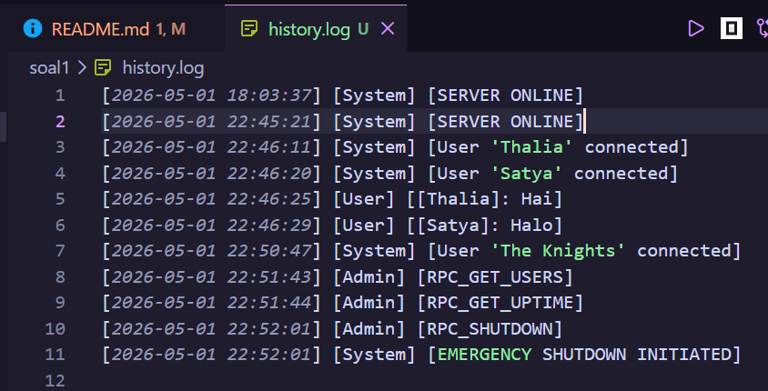

Nama: Gede Satya Putra Aryanta

NRP: 5027251012

---

# Soal 1 - The Wired

## Deskripsi Soal

Pada soal ini, aku membuat sistem komunikasi client-server bertema NAVI dan The Wired. Intinya, ada server pusat yang bisa menerima banyak client, lalu setiap client bisa mengirim dan menerima pesan. Selain chat biasa, program juga punya validasi nama unik, broadcast pesan, fitur admin lewat RPC, dan pencatatan aktivitas ke file `history.log`.

File yang dipakai:

- `soal1/protocol.h`: berisi konfigurasi protocol, port, alamat IP, struktur data client, struktur paket pesan, dan password admin.
- `soal1/wired.c`: program server The Wired.
- `soal1/navi.c`: program client NAVI.

## Cara Menjalankan Program

Compile server:

```bash
gcc soal1/wired.c -o wired
```

Compile client:

```bash
gcc soal1/navi.c -o navi -pthread
```

Jalankan server terlebih dahulu:

```bash
./wired
```

Lalu jalankan client di terminal lain:

```bash
./navi
```

Kalau ingin masuk sebagai admin, gunakan nama:

```text
The Knights
```

Password admin yang dipakai:

```text
admin123
```

Untuk keluar dari client biasa:

```text
/exit
```

## Struktur Data dan Protocol

Konfigurasi utama program aku taruh di `protocol.h`, supaya server dan client memakai aturan yang sama.

```c
#define PORT 8080
#define IP_ADDRESS "127.0.0.1"
#define MAX_CLIENTS 100
#define MAX_NAME_LEN 50
#define BUFFER_SIZE 1024
```

Ada dua struktur utama yang dipakai pada program ini.

```c
typedef struct {
    int socket_fd;
    char username[MAX_NAME_LEN];
    int is_admin;
} NaviIdentity;
```

`NaviIdentity` dipakai saat client pertama kali mendaftar ke server. Isinya adalah socket client, username, dan status apakah client tersebut admin atau bukan.

```c
typedef struct {
    char sender[MAX_NAME_LEN];
    char content[BUFFER_SIZE];
    int is_rpc;
} WiredPacket;
```

`WiredPacket` dipakai untuk pengiriman pesan. Field `is_rpc` digunakan untuk membedakan pesan chat biasa dan request RPC admin.

## Cara Pengerjaan

### 1. Koneksi Stabil NAVI ke Server

**Instruksi soal:** NAVI harus bisa terdaftar ke jaringan pusat melalui alamat dan port yang ditentukan di file protocol, tanpa mengganggu pengguna lain yang sudah terhubung.

**Implementasi pada kode:** alamat IP dan port aku simpan di `soal1/protocol.h`, sehingga `wired.c` dan `navi.c` memakai konfigurasi yang sama.

```c
#define PORT 8080
#define IP_ADDRESS "127.0.0.1"
```

Di `soal1/wired.c`, server membuat socket TCP, mengaktifkan `SO_REUSEADDR`, melakukan `bind()` ke port `8080`, lalu menjalankan `listen()` supaya siap menerima koneksi dari client.

```c
master_sock = socket(AF_INET, SOCK_STREAM, 0);
setsockopt(master_sock, SOL_SOCKET, SO_REUSEADDR, &opt, sizeof(opt));
bind(master_sock, (struct sockaddr *)&address, sizeof(address));
listen(master_sock, 10);
```

Di `soal1/navi.c`, client mengambil alamat dan port dari `protocol.h`, lalu terhubung ke server dengan `connect()`.

```c
server.sin_addr.s_addr = inet_addr(IP_ADDRESS);
server.sin_family = AF_INET;
server.sin_port = htons(PORT);
connect(sock, (struct sockaddr *)&server, sizeof(server));
```

Koneksi baru tidak membuat client lain berhenti, karena server memantau koneksi dengan `select()`. Jika ada koneksi baru, `master_sock` akan terdeteksi aktif dan server menjalankan `accept()`.

### 2. Client Berjalan Asinkron Tanpa Fork

**Instruksi soal:** NAVI harus bisa melakukan dua hal secara asinkron, yaitu menerima transmisi dari The Wired dan mengirim input pengguna, tanpa menggunakan `fork()`.

**Implementasi pada kode:** di `soal1/navi.c`, aku menggunakan `pthread`. Jadi client tidak membuat proses baru dengan `fork()`, melainkan membuat thread tambahan untuk menerima pesan.

```c
pthread_create(&thread_id, NULL, receive_handler, (void*)&sock);
```

Fungsi `receive_handler()` terus menunggu pesan dari server menggunakan `recv()`.

```c
if (recv(sock, &pkg, sizeof(pkg), 0) <= 0) break;
printf("\n[%s]: %s\n> ", pkg.sender, pkg.content);
```

Sementara itu, thread utama tetap membaca input pengguna lalu mengirimkannya ke server.

```c
scanf(" %1023[^\n]", buf);
strcpy(pkg.content, buf);
send(sock, &pkg, sizeof(WiredPacket), 0);
```

Dengan cara ini, client tetap bisa menerima pesan broadcast walaupun pengguna sedang mengetik.

### 3. Server Menangani Banyak Client dengan `select()`

**Instruksi soal:** server The Wired harus bisa menangani banyak client, tidak terhambat oleh satu pengguna yang lambat, bisa membedakan koneksi baru dan pesan masuk, serta menangani diskoneksi client lewat `/exit` maupun interrupt signal.

**Implementasi pada kode:** di `soal1/wired.c`, server memakai `select()` untuk memantau banyak socket dalam satu loop. Socket server utama dan semua socket client aktif dimasukkan ke `fd_set`.

```c
FD_ZERO(&readfds);
FD_SET(master_sock, &readfds);
select(max_sd + 1, &readfds, NULL, NULL, NULL);
```

Kalau `master_sock` aktif, berarti ada client baru yang ingin masuk. Server kemudian menerima koneksi tersebut dengan `accept()`.

```c
if (FD_ISSET(master_sock, &readfds)) {
    new_sock = accept(master_sock, NULL, NULL);
}
```

Kalau socket client yang aktif, berarti client tersebut mengirim pesan atau terputus. Server membaca paketnya dengan `recv()`.

```c
int valread = recv(sd, &pkg, sizeof(pkg), 0);
```

Diskoneksi ditangani saat `recv()` menghasilkan nilai `<= 0`, atau saat client mengirim command `/exit`.

```c
if (valread <= 0 || strcmp(pkg.content, "/exit") == 0) {
    close(sd);
    clients[i].socket_fd = 0;
}
```

Untuk interrupt signal dari sisi client, `soal1/navi.c` memiliki handler `SIGINT`. Saat pengguna menekan `Ctrl+C`, client menutup socket dan keluar dengan lebih rapi.

```c
signal(SIGINT, handle_sigint);
if (active_sock >= 0) close(active_sock);
```

Output dari server dikirim kembali ke client menggunakan `send()`, baik untuk balasan RPC maupun broadcast chat.

### 4. Identitas Unik NAVI

**Instruksi soal:** setiap entitas yang masuk ke The Wired harus memiliki identitas digital berupa nama. Nama tersebut harus unik, sehingga tidak boleh ada dua client aktif dengan nama yang sama.

**Implementasi pada kode:** setelah koneksi berhasil, `soal1/navi.c` meminta pengguna memasukkan nama, lalu mengirimkan data tersebut ke server dalam bentuk `NaviIdentity`.

```c
printf("Enter your name: ");
scanf(" %49[^\n]", me.username);
send(sock, &me, sizeof(NaviIdentity), 0);
```

Di `soal1/wired.c`, server mengecek apakah nama tersebut sudah dipakai oleh client lain yang masih aktif.

```c
if(clients[i].socket_fd > 0 && strcmp(clients[i].username, temp.username) == 0) {
    exists = 1;
}
```

Jika nama sudah dipakai, server mengirim pesan penolakan:

```text
Username '<nama>' is already in use.
```

Jika nama masih tersedia, data client disimpan ke array `clients`, lalu server mengirim balasan `OK`.

```c
clients[i] = temp;
clients[i].socket_fd = new_sock;
strcpy(res.content, "OK");
send(new_sock, &res, sizeof(res), 0);
```

### 5. Broadcast Pesan

**Instruksi soal:** setiap pesan dari satu client harus diteruskan ke semua client lain yang sedang aktif. Proses broadcast harus dilakukan di sisi server.

**Implementasi pada kode:** fungsi `broadcast()` di `soal1/wired.c` melakukan loop ke seluruh array `clients`. Jika socket client aktif dan bukan socket pengirim, server mengirimkan paket pesan ke client tersebut.

```c
void broadcast(WiredPacket pkg, int sender_fd) {
    for (int i = 0; i < MAX_CLIENTS; i++) {
        if (clients[i].socket_fd > 0 && clients[i].socket_fd != sender_fd) {
            send(clients[i].socket_fd, &pkg, sizeof(pkg), 0);
        }
    }
}
```

Saat server menerima pesan biasa, paket tersebut diproses sebagai chat dan dikirim lewat `broadcast()`.

```c
broadcast(pkg, sd);
```

Setelah itu, isi chat juga dicatat ke `history.log`.

```c
snprintf(detail, sizeof(detail), "[%s]: %s", pkg.sender, pkg.content);
write_log("User", detail);
```

### 6. RPC Admin The Knights

**Instruksi soal:** The Wired harus menyediakan prosedur jarak jauh yang hanya bisa dipakai oleh admin atau The Knights. Admin bisa mengecek jumlah NAVI aktif, mengecek uptime server, dan mematikan server. Request ini tidak boleh masuk ke jalur broadcast chat dan harus memakai autentikasi password.

**Implementasi pada kode:** admin dikenali dari username `The Knights` di `soal1/navi.c`. Jika nama tersebut dipakai, client meminta password dan membandingkannya dengan `KNIGHTS_PASSWORD` dari `protocol.h`.

```c
if (strcmp(me.username, "The Knights") == 0) {
    scanf("%49s", password);
    if (strcmp(password, KNIGHTS_PASSWORD) == 0) {
        is_admin = 1;
    }
}
```

Kalau autentikasi berhasil, field `me.is_admin` dikirim ke server.

```c
me.is_admin = is_admin;
send(sock, &me, sizeof(NaviIdentity), 0);
```

Fitur admin yang tersedia:

- `RPC_GET_USERS`: menampilkan jumlah client aktif non-admin.
- `RPC_GET_UPTIME`: menampilkan durasi server berjalan.
- `RPC_SHUTDOWN`: mematikan server.

Menu admin pada client:

```text
1. Check Active Entities (Users)
2. Check Server Uptime
3. Execute Emergency Shutdown
4. Disconnect
```

Saat admin memilih menu, client mengirim paket dengan `pkg.is_rpc = 1`.

```c
pkg.is_rpc = 1;
if (choice == 1) strcpy(pkg.content, "RPC_GET_USERS");
else if (choice == 2) strcpy(pkg.content, "RPC_GET_UPTIME");
else if (choice == 3) strcpy(pkg.content, "RPC_SHUTDOWN");
send(sock, &pkg, sizeof(WiredPacket), 0);
```

Di server, paket RPC dipisahkan dari chat biasa dengan mengecek `pkg.is_rpc`.

```c
if (pkg.is_rpc) {
    ...
}
```

Server juga memastikan bahwa socket pengirim benar-benar milik admin. Jika bukan admin, server mengirim pesan error.

```text
Error: Admin privileges required
```

Untuk command-nya, `RPC_GET_USERS` menghitung client aktif non-admin, `RPC_GET_UPTIME` menghitung durasi sejak server dinyalakan, dan `RPC_SHUTDOWN` mencatat shutdown lalu menjalankan `exit(0)`.

### 7. Logging ke `history.log`

**Instruksi soal:** setiap transmisi harus dicatat secara permanen di `history.log`. Tiap baris log harus memiliki format `[YYYY-MM-DD HH:MM:SS] [System/Admin/User] [Status/Command/Chat]`.

**Implementasi pada kode:** proses logging dilakukan oleh fungsi `write_log()` di `soal1/wired.c`. Fungsi ini membuka file `history.log` dalam mode append, membuat timestamp dengan `strftime()`, lalu menulis log sesuai format.

```c
fprintf(fp, "[%s] [%s] [%s]\n", timestamp, type, detail);
```

Format timestamp dibuat seperti ini:

```c
strftime(timestamp, sizeof(timestamp), "%Y-%m-%d %H:%M:%S", t);
```

Aktivitas yang dicatat:

- Server online.
- User terhubung.
- User terputus.
- Chat yang berhasil diproses server.
- Command RPC admin.
- Emergency shutdown.

Contoh isi `history.log`:

```text
[2026-04-26 19:06:40] [System] [SERVER ONLINE]
[2026-04-26 19:06:46] [System] [User 'alice' connected]
[2026-04-26 19:06:50] [System] [User 'lain' connected]
[2026-04-26 19:06:56] [User] [[alice]: hello lain]
[2026-04-26 19:06:59] [User] [[lain]: hello alice]
[2026-04-26 19:07:11] [System] [User 'alice' disconnected]
[2026-04-26 19:07:27] [System] [User 'The Knights' connected]
[2026-04-26 19:07:29] [Admin] [RPC_GET_USERS]
[2026-04-26 19:07:29] [Admin] [RPC_GET_UPTIME]
[2026-04-26 19:07:31] [Admin] [RPC_SHUTDOWN]
[2026-04-26 19:07:31] [System] [EMERGENCY SHUTDOWN INITIATED]
```

## Dokumentasi Hasil Uji

### Screenshot 1 - Server The Wired Online

Server berhasil dijalankan dan sudah siap menerima koneksi client.

```md

```

### Screenshot 2 - Dua Client Berhasil Terhubung

Dua client berhasil masuk dengan username yang berbeda, sehingga keduanya diterima sebagai entitas aktif.

```md



```

### Screenshot 3 - Validasi Username Duplikat

Saat client mencoba memakai nama yang sudah aktif, server menolak pendaftaran nama tersebut.

```md

```

### Screenshot 4 - Broadcast Chat

Pesan yang dikirim oleh satu client berhasil diterima oleh client lain melalui broadcast dari server.

```md

```

### Screenshot 5 - Admin RPC

Admin `The Knights` berhasil login dan menjalankan command RPC, seperti mengecek jumlah user aktif dan uptime server.

```md

```

### Screenshot 6 - History Log

File `history.log` berisi catatan aktivitas server, user, chat, dan command admin sesuai format yang diminta.

```md

```

## Kendala dan Error Selama Pengerjaan

### 1. Client Harus Bisa Kirim dan Terima Pesan Bersamaan

Kendala utama di client adalah bagaimana caranya tetap menerima pesan broadcast saat pengguna sedang mengetik input. Solusinya adalah memakai `pthread`, sehingga proses menerima pesan berjalan di thread terpisah, sementara thread utama tetap menangani input.

### 2. Server Tidak Boleh Terhambat Satu Client

Kalau server hanya memakai `recv()` biasa secara berurutan, satu client yang lambat bisa membuat server menunggu terlalu lama. Karena itu aku memakai `select()`, supaya server hanya membaca socket yang memang sedang aktif.

### 3. Pemisahan Chat dan RPC

Command admin tidak boleh ikut dibroadcast ke client lain. Untuk membedakannya, struktur `WiredPacket` diberi field `is_rpc`. Jika nilainya `1`, server memproses paket sebagai RPC. Jika nilainya `0`, server memprosesnya sebagai chat biasa.

### 4. Username Duplikat

Server perlu memastikan tidak ada dua client aktif dengan nama yang sama. Pengecekan dilakukan saat client baru mengirim `NaviIdentity`. Jika nama sudah ada di array `clients`, koneksi client baru langsung ditolak.
